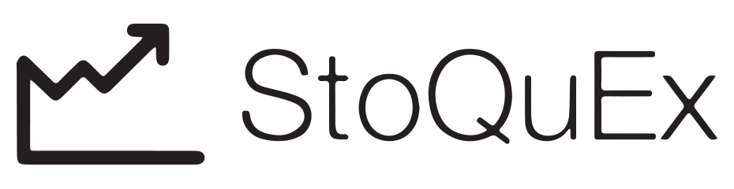

StoQueX stands for Stock Quotes Explorer. It's an app used to explore quotes from a database.

StoQueX is a school project used to learn the basic principles behined the developpment of a web app. This version of StoQueX has been built by [Maxime Aubaret](github.com/maximeaubaret) and [Alexandre Toni](github.com/kickout).

Live Demo
---------
To see StoQueX running live, you can go on http://pg217.herokuapp.com/. In this version, only AAPL, MSFT and GOOG are availabled in order to stay inside the limit of storage a database can have on Heroku.

Database structure
------------------
The database is composed of 2 tables : *symbols* and *quotes*.

- *symbols* is used to associate a company symbol to its name, its sector, and where the stock is traded.
- *quotes* is the list of quotes associated to a company on a certain date.

Brought to you by
-------
-  [Maxime Aubaret](github.com/maximeaubaret) 
-  [Alexandre Toni](github.com/kickout)

The MIT License (MIT)
---------------------
Copyright © 2013 Maxime Aubaret, Alexandre Toni

Permission is hereby granted, free of charge, to any person obtaining a copy of this software and associated documentation files (the “Software”), to deal in the Software without restriction, including without limitation the rights to use, copy, modify, merge, publish, distribute, sublicense, and/or sell copies of the Software, and to permit persons to whom the Software is furnished to do so, subject to the following conditions:

The above copyright notice and this permission notice shall be included in all copies or substantial portions of the Software.

THE SOFTWARE IS PROVIDED “AS IS”, WITHOUT WARRANTY OF ANY KIND, EXPRESS OR IMPLIED, INCLUDING BUT NOT LIMITED TO THE WARRANTIES OF MERCHANTABILITY, FITNESS FOR A PARTICULAR PURPOSE AND NONINFRINGEMENT. IN NO EVENT SHALL THE AUTHORS OR COPYRIGHT HOLDERS BE LIABLE FOR ANY CLAIM, DAMAGES OR OTHER LIABILITY, WHETHER IN AN ACTION OF CONTRACT, TORT OR OTHERWISE, ARISING FROM, OUT OF OR IN CONNECTION WITH THE SOFTWARE OR THE USE OR OTHER DEALINGS IN THE SOFTWARE.

